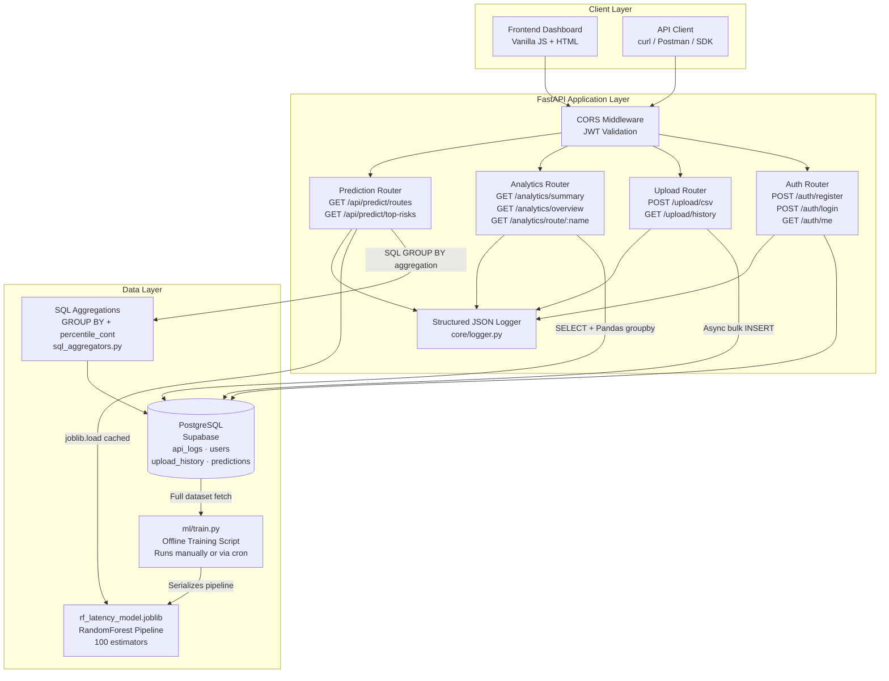
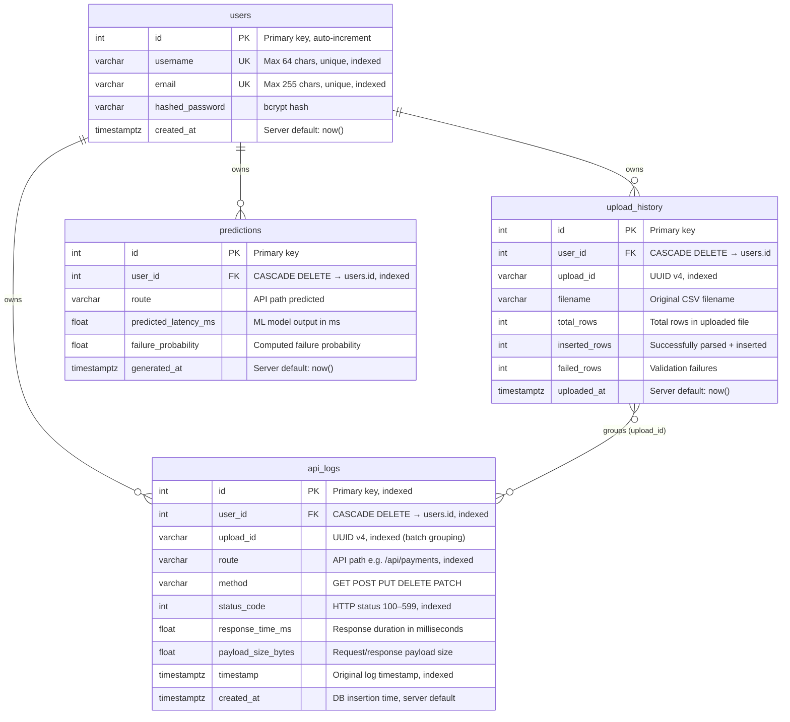
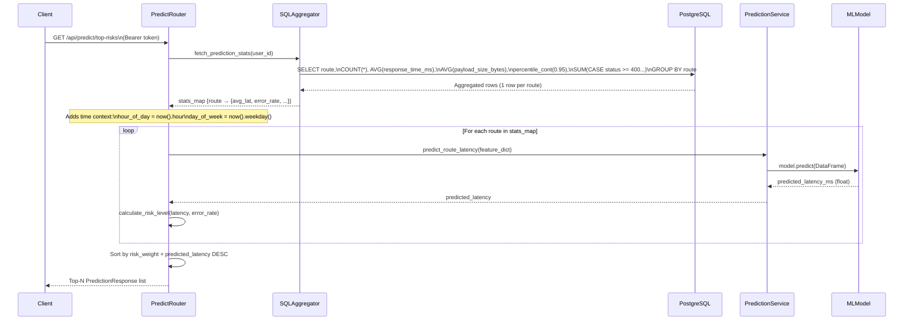
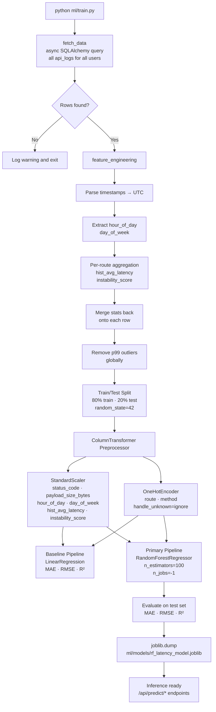

# API-Pulse — Architecture Documentation

## 1. System Flow

API-Pulse operates on a three-tier architecture. The **Client Layer** communicates exclusively via JWT-authenticated HTTP requests. The **Application Layer** (FastAPI) routes each request to the appropriate service. The **Data Layer** consists of PostgreSQL for persistence and a serialized Joblib model for ML inference.



---

## 2. Database Schema



### Key Indexes

| Table | Column(s) | Reason |
|---|---|---|
| `api_logs` | `(user_id)` | All analytics queries filter by user |
| `api_logs` | `(route)` | GROUP BY route in aggregations |
| `api_logs` | `(status_code)` | Error rate computation |
| `api_logs` | `(timestamp)` | Time-windowed queries (last 24h, 7d) |
| `users` | `(username)`, `(email)` | Uniqueness enforcement at DB level |

---

## 3. Prediction Workflow



---

## 4. ML Training Pipeline



---

## 5. PostgreSQL GROUP BY Optimization

### Problem

The initial analytics approach loaded **all** `api_logs` rows for a user into memory as a Pandas DataFrame, then computed aggregations in Python. For users with 100k+ rows, this caused:
- High memory pressure in the container
- 500–2000ms latency on prediction endpoints

### Solution: Native SQL Aggregation

The `services/sql_aggregators.py` module pushes all aggregation work directly into PostgreSQL using a single `GROUP BY` query:

```sql
SELECT
    route,
    COUNT(id)                                              AS total,
    SUM(CASE WHEN status_code >= 400 THEN 1 ELSE 0 END)   AS errors,
    AVG(response_time_ms)                                  AS avg_lat,
    AVG(payload_size_bytes)                                AS avg_payload,
    percentile_cont(0.95) WITHIN GROUP
        (ORDER BY response_time_ms ASC)                    AS p95_lat
FROM api_logs
WHERE user_id = :user_id
GROUP BY route;
```

**Benefits:**
- PostgreSQL executes this in a single sequential scan with hash aggregation
- `percentile_cont` is a native ordered-set aggregate — far more efficient than fetching raw data and calling `DataFrame.quantile()`
- Returns **one row per route** regardless of dataset size
- Response time improvement: ~10× on datasets with 50k+ rows

---

## 6. Logging Architecture

Every request path emits structured JSON logs:

```json
{
  "timestamp": "2024-05-15T10:30:00.123456+00:00",
  "level": "INFO",
  "message": "CSV Upload complete",
  "service": "api-pulse",
  "version": "1.0.0",
  "module": "upload_router",
  "user_id": 42,
  "upload_id": "f47ac10b-58cc-4372-a567-0e02b2c3d479",
  "filename": "api_logs_may.csv",
  "inserted_rows": 997,
  "failed_rows": 3
}
```

Configure via env vars:
- `LOG_LEVEL` — sets the minimum severity (default `INFO`)
- `LOG_FILE` — optional path; if set, logs are also written to a rotating file handler
